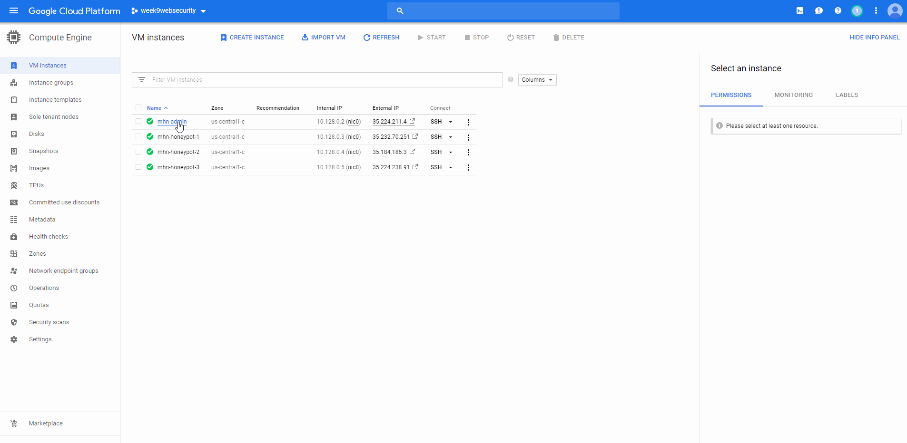
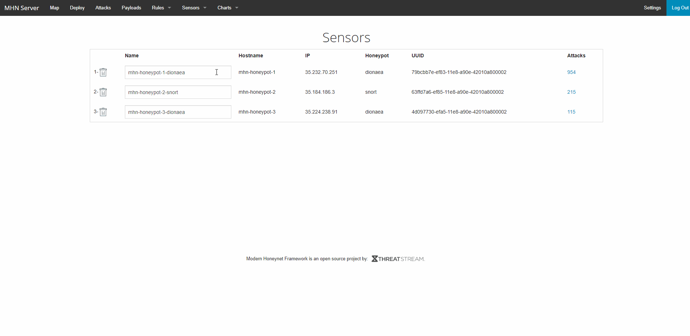
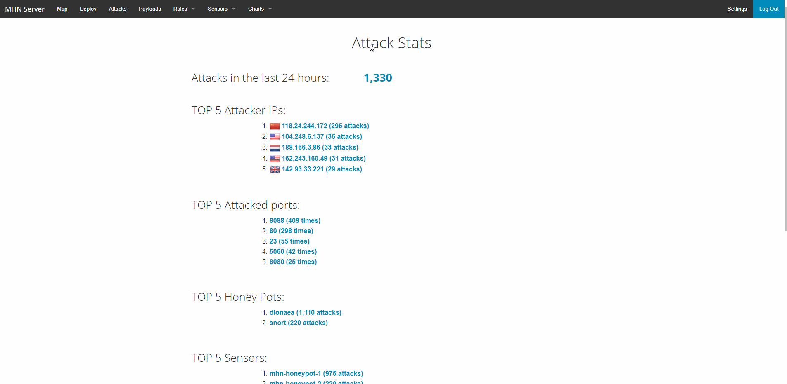
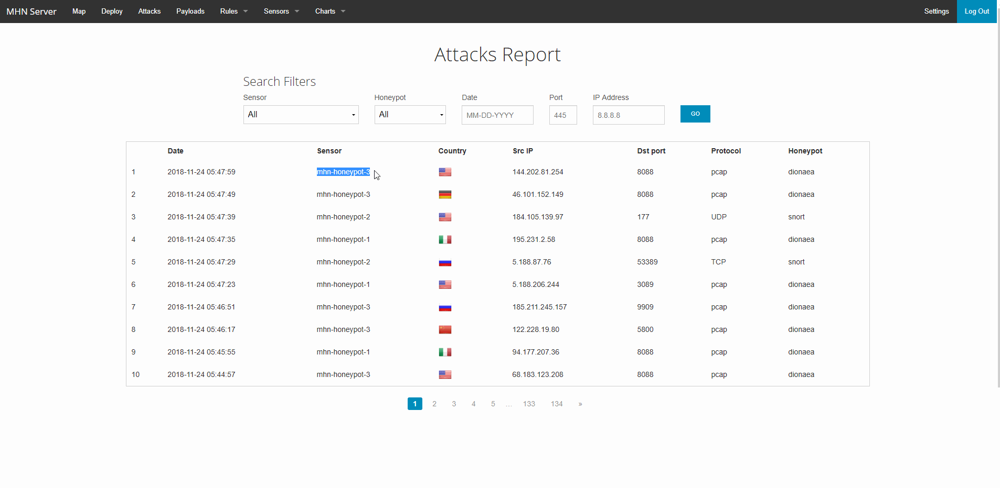

# Project 9 - Honeypot

Time spent: **20** hours spent in total

> Objective: Learn about Network Security by attacking and being attacked at vulnarable networked resources. Multiple Honey Pot VM instances were created to demonstrate it.

# Which HoneyPot(s) you deployed
  - mhn-honeypot-1 : dionaea
  - mhn-honeypot-2 : snort
  - mhn-honeypot-3 : dionaea
  
# Any issues you encountered
> I had to set up the VM's multiple times from scratch, which was really time consuming. 

# A summary of the data collected: number of attacks, number of malware samples, etc.

  1. Google Cloud Platform and HoneyPot set up.
     * I used the Google Cloud Platform to set up VM's (Ubuntu Trusty 14.04), installed MHN. 
     * One admin VM instance, three honeypot VM instances
     * GIFS: 
     1. GIF of my VM instances
     
     2. GIF of my sensors
     
     3. GIF of my attacks
     
     4. GIF of the attack reports
     
 # Any unresolved questions raised by the data collected
 > None
 
 # Resources
 [LiceCap](https://www.cockos.com/licecap/)
 
 ## License

    Copyright [2018] [Melvin Tham]

    Licensed under the Apache License, Version 2.0 (the "License");
    you may not use this file except in compliance with the License.
    You may obtain a copy of the License at

        http://www.apache.org/licenses/LICENSE-2.0

    Unless required by applicable law or agreed to in writing, software
    distributed under the License is distributed on an "AS IS" BASIS,
    WITHOUT WARRANTIES OR CONDITIONS OF ANY KIND, either express or implied.
    See the License for the specific language governing permissions and
    limitations under the License.
 

    
    
